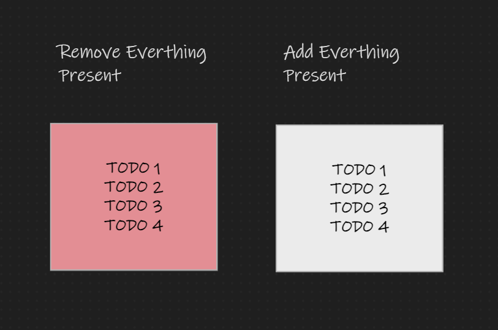
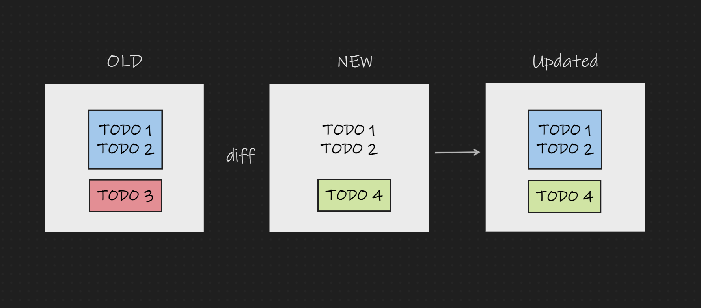
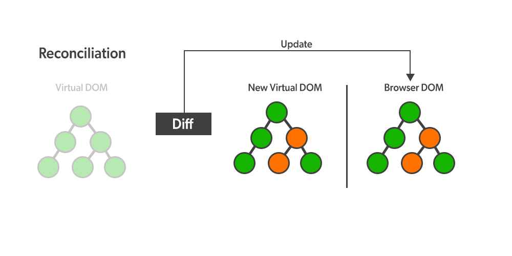

# ReactReconcilerProject

This repository is designed to help you understand the concept of Virtual DOM (VDOM) and why it is beneficial to use in React. It provides an overview of different stages involved in the reconciliation process within React and highlights some key properties and functions that play a crucial role in manipulating the DOM.

## Stages of Reconciliation

### Stage 1 (DOM Refresh)



In this initial stage of reconciliation, the goal is to remove everything that is already present in the DOM and add everything that is new in the browser's DOM. While this approach ensures that the DOM accurately reflects the current state of the application, it can be an expensive operation in terms of performance.

### Stage 2 (DOM Diff)



Stage 2 involves calculating the differences between the previous DOM and the current DOM and making changes accordingly. This approach is faster than Stage 1, but it still involves performing operations directly on the browser's DOM, making it relatively expensive in terms of performance.

### Stage 3 (Virtual DOM)


[source link](https://www.geeksforgeeks.org/what-is-diffing-algorithm/)

To address the inefficiencies of the previous two stages, React introduces the concept of a Virtual DOM (VDOM). Instead of fetching the complete DOM, React maintains a copy of the original DOM in the Virtual DOM. For the current state, it refers to the VDOM instead of directly interacting with the original DOM. Only the differences between the VDOM and the original DOM are updated, which results in more efficient updates. The Virtual DOM is typically represented as a tree-like data structure.

## Properties and Functions

1. `Array.from` & `children`: The `children` property returns an HTMLCollection or a NodeList, which are array-like objects, not actual JavaScript arrays. To use built-in array methods like `forEach()`, `map()`, etc., you can convert it into an actual JavaScript array using the `Array.from` method. For example:

   ```jsx
   var currentChildren = Array.from(parentElement.children);
   ```

2. `dataset.id`: When dealing with objects in the array, you may come across various properties. While creating to-do items, it's common to store an `id` in the `dataset`. This property can be used to uniquely identify and manage individual elements within your application.

By exploring this project, you can gain a deeper understanding of React's reconciliation process and the advantages of using a Virtual DOM to optimize web application performance.
